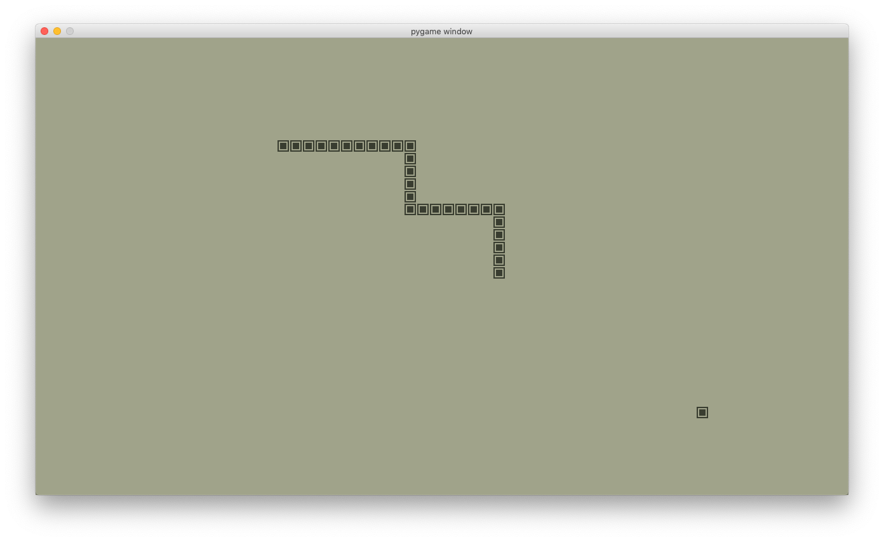
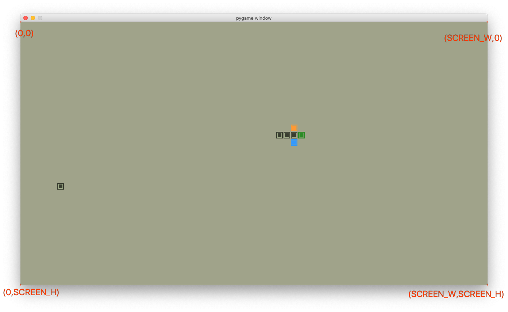

# 这99行Python代码，写的不是贪吃蛇，是情怀

## 1. 情怀
小时候街对面的游戏厅提供3种游戏机：

最吸引人的就是投币的街机，《雷电》、《快打旋风》、《快乐射手》（Hacha Mecha Fighter）


其次是链接着大玻璃壳子电视机的红白游戏机，可以玩《魂斗罗》，《街头霸王》。费用是一元一小时。

掌上游戏机也被拿来赚钱，就是这种方块游戏机，BrickGame。可以玩《俄罗斯方块》，《贪吃蛇》。费用是五毛一小时。


我往往凑不够一元钱，便时常光顾掌机。

往往有一种人非常烦人，每当你玩俄罗斯方块的时候，他就不请自来的站在旁边。

倘若只是默默的站在旁边也还罢了，往往还要发表一些议论。

倘若只是发表议论也可以忍他，往往还有一些“指挥家”，偏偏要瞎指挥，“转一下再放”，“再往左”...

我往往觉得这种人是来占我的便宜的，明明是我花了钱的，他们却指挥起我来，仿佛我成了他手里的手柄，他们把极大的乐趣都从我这里夺走了。遇到这种人我便不再玩《俄罗斯方块》，而改玩更容易掌控的《贪吃蛇》，然后边玩边说，左边，下去...,总之不给别人指挥我的机会，看着“指挥家”们悻悻地离去也是一种乐趣。

高中的时候有了微机课，用上了8086，当时还在用软驱，插进去嘎吱嘎吱半天才能读出数据。当时学校开设了BASIC语言，我是极有兴趣的，只可惜微机课时间有限，平时我们也没时间自己去机房。

等我进入大学，学的是计算机科学与技术，虽然家境拮据，但也买了二手的电脑，印象中应该是台486，当时没有液晶屏只有玻璃壳子显示器。把分辨率什么的能设置的参数都设置到最低，也可以运行《古墓丽影》。当时已经有j2me了，于是学着写了个贪吃蛇，当时刚学过面向对象，于是大用特用的写了一大堆类。我自己的手机是非智能的手机，于是在同学的摩托罗拉大屏LCD手机上做测试。发现可以运行，着实高兴了好几天。但当时战斗力只有5，代码一多总有这样那样的bug，后来就不了了之了。但学j2me的经历却于我后来找工作有益，2004年我第二份工作便是用j2me编写IM软件。可以说从编写哪个j2me贪吃蛇开始，我便与移动互联网结了缘。

时过境迁，老猿成精，回顾当初编写贪吃蛇的经历不禁莞尔，其实可以有很多种做法，而我当时选了最艰难的一条路。最近突然来了兴致，圆一下大学时想做游戏的梦。

## 2. 追求

做什么事情都要追求极致，为了尽量还原LCD的感觉，我特意查找了相关图片素材进行观察。

颜色的取值和形状的绘制都反复尝试对比，最终到达的效果如下：



最后我觉得直接画出来的“Game Over”提示太过圆润。


于是又在snake+.py里面使用了点阵绘制“Game Over”


## 3. 算法
接下来跟朋友们聊聊算法，了解了这个算法，
你就能在任意平台上用任意语言，用最简洁的代码写出贪吃蛇。

首先要有游戏引擎，这里我选pygame。

2d游戏引擎的思路往往都是相通的。

那就是做一个循环，不断的绘制画面，并且响应按键事件。

就像这样：
```python
if __name__ == "__main__":
    pygame.init() # 初始化引擎
    clock = pygame.time.Clock() # 初始化时钟
    win = pygame.display.set_mode((SCREEN_W, SCREEN_H)) # 设置窗口分辨率
    reset() # 重置角色位置等信息
    running = True
    while running:
        clock.tick(30) # 设置时钟频率
        for e in pygame.event.get():
            if e.type == pygame.QUIT: # 窗口关闭按钮被按下时会触发pygame.QUIT
                running = False

            if e.type == pygame.KEYDOWN: # 按键被按下
                if e.key == pygame.K_ESCAPE: # 按键是ESC键
                    running = False
                else:
                    reset() if is_gameover else trun(e.key) 
                    # GameOver的时候任意键都重置，否则根据按键转向

        win.fill(BG_COLOR, (0, 0, SCREEN_W, SCREEN_H)) # 背景色刷新整个屏幕
        move() # 移动角色
        draw(win) # 绘制角色
        pygame.display.flip() # 使之前的绘制生效

    pygame.quit() # 退出游戏
```

如果按下了ESC键就退出

如果是方向键就改变角色的行为。

如果当前是Game Over的状态，按任意键都可以从头再来。

改变变量running，让它=False就可以退出游戏。

改变clock.tick(30)可以控制画面刷新的速度。

### 3.1 如何表示一条蛇

我们可以把每个节点的坐标保存到一个数组里面。
当绘制蛇的时候，只需要遍历数组，然后按照数组里面的每个坐标绘制一个节点，就会连成一条完整的蛇了。

例如：
```python
snake = [(140, 300), (120, 300), (100, 300)]
```
这就表示这条蛇有3个节点每个节点的坐标依次是，(140, 300), (120, 300), (100, 300)。

### 3.2 如何让蛇移动

如果按照仿生学，或者通常的思维逻辑，让一条蛇移动，可以先移动它的头，然后身体的每一部分都沿着头移动的方向前进相等距离就可以了。然而这样做是很复杂的，你需要将转弯的信息传递到每一节，或者设计一系列的规则来控制每一节之间的距离。

其实先人们已经做过各种尝试，并用极简的思路设计了算法。

其中一个办法是，在蛇头旁边，沿着蛇运动的方向放置一个节点。然后去掉尾部节点。


上图中的第一行是移动之前的状态，

首先在蛇运动的方向上添加一个节点（第二行蓝色的那个）。

然后在蛇的尾部去掉1个节点（第二行红色的那个）。

这样看起来整条蛇向头部沿着运动方向移动了一个节点的距离。

实际上只有头尾发生了变化。

如果是吃到了食物，则不需要删除尾部节点，这样就能让整个蛇的长度加一。

现在你知道用数组表示蛇身体的好处了吧，增加和删除节点都是数组的强项。

### 3.3 如何让蛇转向

除了记录蛇上每个节点的位置，我们还需要记录蛇头移动的方向，以便确定下一次在什么位置添加节点作为新蛇头。

我们可以用两个变量，direct_x, direct_y分别表示x轴上的方向和y轴上的方向。然后我们就能用-1和1表示左右和上下。
```
当蛇向左移动的时候direct_x = -1, direct_y = 0
当蛇向右移动的时候direct_x = 1, direct_y = 0
当蛇向上移动的时候direct_x = 0, direct_y = -1
当蛇向下移动的时候direct_x = 0, direct_y = 1
```

以下图为例，蛇头位于（800，380）。

如果让蛇向右继续直行，下个新增节点应位于绿色位置。

newNode.x = head.x + CELL_SIZE
newNode.y = head.y 

不难想象，如果让蛇向左移动
newNode.x = head.x - CELL_SIZE
newNode.y = head.y 

如果让蛇向上转向，下个新增节点应位于橙色位置。
newNode.x = head.x
newNode.y = head.y - CELL_SIZE

如果让蛇向下转向，下个新增节点应位于蓝色位置。
newNode.x = head.x
newNode.y = head.y + CELL_SIZE

发现规律了没，我们可以不用做任何判断直接得到下一个节点的位置
newNode.x = head.x + direct_x * CELL_SIZE
newNode.y = head.y + direct_y * CELL_SIZE

这就是我们不用一个变量的四种值（比如：1,2,3,4）表示上下左右四个方向的原因。

了解了如何移动和转向，你是否理解这行代码的作用呢？
```python
snake.insert(0, (x+direct_x*CELL_SIZE, y+direct_y*CELL_SIZE))
```
没错，就是在下一个蛇头出现的位置上，插入一个新蛇头。



### 3.4 如何判断是否撞墙

假设窗口的四周都是墙。

当一个点的x值小于0时，我们可以肯定这个点超过了左边那堵墙。

当一个点的x值大于屏幕宽度时，我们可以肯定这个点超过了右边那堵墙。

当一个点的y值小于0时，我们可以肯定这个点超过了上面那堵墙。

当一个点的y值大于屏幕高度时，我们可以肯定这个点超过了下面那堵墙。

```python
 if x < 0 or x >= SCREEN_W or y < 0 or y >= SCREEN_H :
   #撞墙了...
```

判断撞墙是不是很简单？

### 3.5 如何判断是否撞到了身体
我们用数组表示整条蛇，头和身体也好区分

snake[0] 就是蛇头
snake[1:] 就是蛇身体

仔细观察下图，橙色就是蛇头，体会一下头撞到身体的感觉。


是的，头的坐标和身体中的一节坐标相同了。

因此我们可以在身体里找有没有头的坐标，来判断撞到身体。

完整的game over判断如下：
```python
if x < 0 or x >= SCREEN_W or y < 0 or y >= SCREEN_H or snake[0] in snake[1:]:
    is_gameover = True
    return
```
够简洁吧。